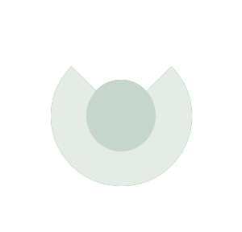

<div align="center">


# Noto

A simple, focused note taking app built with Dart and Flutter.

<p>

    
    
  </p>   <p>
    <a href="#about">About</a>
    ·
    <a href="#features">Features</a>
    ·
    <a href="#getting-started">Getting Started</a>
    ·
    <a href="#contributing">Contributing</a>
  </p>
</div>

## About

Noto is a lightweight note taking application designed to make capturing ideas quick and distraction free. Its clean interface helps you write, organize, and revisit notes without unnecessary complexity.

## Features

| Feature | Description |
| --- | --- |
| Note taking | Create and edit notes in a focused writing experience. |
| Organized workspace | Keep ideas easy to browse and manage. |
| Cross platform foundation | Built with Flutter for a consistent application experience. |
| Simple visual language | A calm interface centered around clarity and usability. |

## Built With

| Technology | Purpose |
| --- | --- |
| [Dart][1] | Application programming language |
| [Flutter][2] | Cross platform UI framework |

## Getting Started

### Prerequisites

Install [2] and the SDK dependencies required for your target platform. An editor such as [3] or [4] is recommended.

Verify the installation with:

```bash
flutter doctor
```

### Installation

Clone the repository and install its dependencies:

```bash
git clone https://github.com/your-username/noto.git
cd noto
flutter pub get
```

Replace `your-username/noto` with the official repository URL after publication.

### Run the app

```bash
flutter run
```

### Build a release version

```bash
flutter build apk --release
flutter build web --release
```

## Project Structure

```
noto/
├── android/        Android platform files
├── ios/            iOS platform files
├── lib/            Main Dart application source
├── test/           Automated tests
├── assets/         Images, icons, and bundled resources
├── pubspec.yaml    Dependencies and project configuration
└── README.md       Project documentation
```

## Contributing

Contributions are welcome. Please read [CONTRIBUTING.md](CONTRIBUTING.md) before opening an issue or pull request. All contributors are expected to follow [CODE_OF_CONDUCT.md](CODE_OF_CONDUCT.md).

## Fork Support Policy

Noto welcomes experimentation and independent forks. However, **unofficial forks are separate projects and are not supported by the Noto maintainers**.

The Noto team is not responsible for the behavior, releases, security, documentation, hosting, changes, or user support of any fork. Issues caused by changes made in a fork must be reported to that fork's maintainers.

Changing the application name, package identifiers, branding, dependencies, backend services, build configuration, or source code places the resulting project outside official Noto support. Fork maintainers are responsible for their own releases, issue trackers, documentation, and user communications.

## License

Noto is released under the [MIT License](LICENSE). You may use, copy, modify, merge, publish, distribute, sublicense, and sell copies of the software in accordance with the license terms.

## References

[1]: https://dart.dev/ "Dart official website"

[2]: https://flutter.dev/ "Flutter official website"

[3]: https://code.visualstudio.com/ "Visual Studio Code official website"

[4]: https://developer.android.com/studio "Android Studio official website"

<div align="center">
<sub>Noto · Capture what matters.</sub>
    

    

  
    

  <sub>Developed by <strong>Neptunium Laboratory</strong></sub>
</div>
